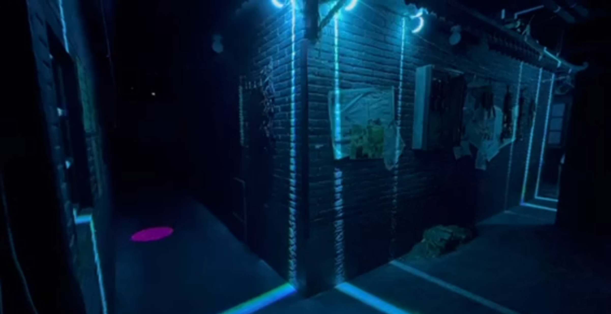

<!-- First Section: Past Electronic Music Productions -->

This is the page for my productions showcase, for my research output demos: (<a href="https://shinxinyangdemo.github.io/shinxinyangdemo.github.io-research/" target="_blank">shinxinyangdemo.github.io/shinxinyangdemo.github.io-research/</a>)

<h1>Past Electronic Music Productions Previews, released in 2020</h1>

<!-- Description -->

    These releases under the name 'ussoanah' (<a href="https://soundcloud.com/ussoanah/tracks" target="_blank">soundcloud.com/ussoanah/tracks</a>) reflect my early exploration of electronic music, experimenting with a variety of genres, aiming for more impactful mixes and unique sound designs. Although quite different from my current productions, I still like the ideas behind these tracks.

<!-- Add CSS for Grid Layout -->

<!-- Grid Container for Audio Previews -->

    <!-- First Row -->
    

        <h3>Binds</h3>
        <i>trap, future bass</i>
        <audio controls>
            <source src="binds_preview.wav" type="audio/wav">
            Your browser does not support the audio element.
        </audio>
    

    

        <h3>Summer Was Fun</h3>
        <i>deep, melodic house</i>
        <audio controls>
            <source src="summer was fun_preview.wav" type="audio/wav">
            Your browser does not support the audio element.
        </audio>
    

    <!-- Second Row -->
    

        <h3>Deep Like the Ocean</h3>
        <i>trap</i>
        <audio controls>
            <source src="deep like the ocean_preview.wav" type="audio/wav">
            Your browser does not support the audio element.
        </audio>
    

    

        <h3>Blast</h3>
        <i>riddim dubstep (sorry this one can be annoying haha)</i>
        
        <audio controls>
            <source src="blast_preview.wav" type="audio/wav">
            Your browser does not support the audio element.
        </audio>
    

<!-- Image -->

<!-- Second Section: Current Electronic Music Productions -->
<h1>Current Electronic Music Productions Previews (Unreleased)</h1>

<!-- Improved Description -->

    <b>Way better mixed to my ears now.</b> Focusing on tech house—one of today’s most popular genres. They showcase my latest mixing & mastering style, structures, and arrangements, laying the groundwork for my upcoming project.

<!-- Add CSS for Flexbox (if not already included) -->

<!-- Flexbox Container for Current Previews -->

    

        <h3>Away</h3>
        <audio controls>
            <source src="all_the_way_preview.wav" type="audio/wav">
            Your browser does not support the audio element.
        </audio>
    

    

        <h3>Dream</h3>
        <audio controls>
            <source src="dream_preview.wav" type="audio/wav">
            Your browser does not support the audio element.
        </audio>
    

    

        <h3>Move</h3>
        <audio controls>
            <source src="move_preview.wav" type="audio/wav">
            Your browser does not support the audio element.
        </audio>
    

<!-- Third Section: Soundtracks for Interactive Theatre -->
<h1>Soundtracks for Interactive Theatre</h1>

The indoor interactive theatre showcased original stories, where I took on the role of sound designer, horror-themed plays mostly.

<h3>Soundtrack 1</h3>

Start of one scene and following ambience

<audio controls>
    <source src="soundtrack 2.wav" type="audio/wav">
    Your browser does not support the audio element.
</audio>

<h3>Soundtrack 2</h3>

Almost the end of one ending triggered

<audio controls>
    <source src="soundtrack 3.wav" type="audio/wav">
    Your browser does not support the audio element.
</audio>

<h3>Soundtrack 3</h3>

Tension buildup

<audio controls>
    <source src="soundtrack 1.wav" type="audio/wav">
    Your browser does not support the audio element.
</audio>

<h3>Soundtrack 4</h3>

Quarrel

<audio controls>
    <source src="soundtrack 4.wav" type="audio/wav">
    Your browser does not support the audio element.
</audio>

<h3>Soundtrack 5</h3>

Accident happened

<audio controls>
    <source src="soundtrack 5.wav" type="audio/wav">
    Your browser does not support the audio element.
</audio>

<!-- Images for the Theatre Soundtracks -->

    <!-- Second Row: Smaller Third Image -->
    

        
    

"Back when Work-in-progress, one of the theatre scenes, depicting replicas of small towns from the 1990s."

<h1>End</h1>

Thank you for taking the time to explore my work! If you’d like to see more, I’d be glad to share additional projects. I’m confident that my experience and insights can provide valuable guidance and constructive feedback to support students in their creative endeavors.

